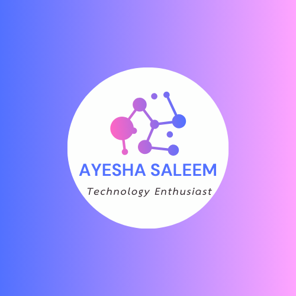

<!-- ─────────────────────────  HERO  ────────────────────────── -->

<!-- ▸ BANNER  (delete this <picture> block if you don’t have assets/banner.png) -->
<picture>
  <source media="(max-width:600px)" srcset=""><!-- hide on phones -->
  
</picture>

<!-- ▸ TYPING HEADLINE -->

  

<em>Turning data into delightful products ✨</em>

  <a href="mailto:ayeshasaleem61203@gmail.com">Email</a> •
  <a href="https://www.linkedin.com/in/ayesha-saleem-60429627b/">LinkedIn</a> •
  <a href="https://gitwitayesha.github.io">Portfolio</a>

<!-- ───────────────────────  ABOUT ME  ──────────────────────── -->

<h3 align="center">📌 About&nbsp;Me</h3>

<ul>
  <li>🎓 5th-semester CS student, Karachi</li>
  <li>🤖 Building with <strong>Python · TensorFlow · OpenCV · FastAPI</strong></li>
  <li>📝 Blogging & mentoring at local AI meet-ups</li>
  <li>🎯 Seeking an <strong>AI internship</strong>, Summer&nbsp;2025</li>
</ul>

<!-- ──────────────────────  TECH TOOLKIT  ───────────────────── -->

<h3 align="center">⚙️ Tech&nbsp;Toolkit</h3>

  <!-- Row 1 -->
  
  
  
   
  <!-- Row 2 -->
  
  
  

<!-- ───────────────────────  DASHBOARD  ─────────────────────── -->

  
  

<!-- ────────────────────  FEATURED PROJECTS  ────────────────── -->

<h3 align="center">🚀 Featured&nbsp;Projects</h3>

  
  

<!-- ─────────────────────────  FOOTER  ──────────────────────── -->

“Value · Transparency · Communication” — guiding every commit.

