<!-- GitHub profile README for @GitwitAyesha -->

<!-- ─────────────────────────  HERO  ────────────────────────── -->
<picture>
  <!-- Hide banner on narrow screens -->
  <source media="(max-width: 600px)" srcset="">
  
</picture>

<h1 align="center">Hi, I’m <strong>Ayesha Saleem</strong> 👋</h1>

AI &amp; Data-Science Enthusiast · Karachi, Pakistan

<!-- ───────────────────────  CONTACT/SHORT LINKS  ───────────── -->

  <a href="mailto:ayeshasaleem61203@gmail.com">Email</a> •
  <a href="https://www.linkedin.com/in/ayesha-saleem-60429627b/">LinkedIn</a> •
  <a href="https://github.com/GitwitAyesha">GitHub</a>

<!-- ─────────────────────────  TOOLKIT  ─────────────────────── -->
<h3 align="center">🛠 Tech Toolkit</h3>

  
  
  
   <!-- breakpoint for mobile -->
  
  

<!-- ─────────────────────────  METRICS  ─────────────────────── -->

  

<!-- ─────────────────────────  PROJECTS  ────────────────────── -->
<h3 align="center">🚀 Featured Projects</h3>

  
  

<!-- ─────────────────────────  FOOTER  ──────────────────────── -->

  “Value, transparency, communication.†— My guiding principles for every commit.

